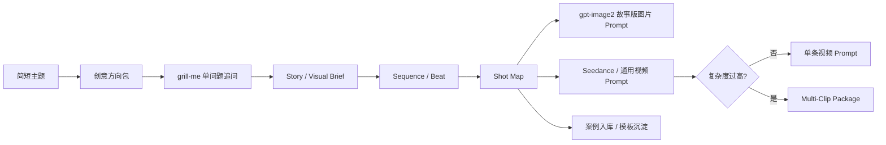

# storyboard-video-director

[中文](README.md) | [English](README_en.md)

## AI 故事版与视频分镜导演 Skill

`storyboard-video-director` 是一个面向 **AI 视频制作、影视前期、故事版设计、gpt-image2 图片故事版 Prompt、Seedance / 通用视频 Prompt** 的标准 Skill 包。

它不是一组固定提示词，而是一套可复用的影视前期工作流：从一句简短主题出发，完成创意发散、grill-me 追问、故事扩展、分镜设计、故事版图片 Prompt、视频 Prompt、案例入库与模板沉淀。

---

## 1. 这个 Skill 解决什么问题

| 问题 | 传统做法 | 本 Skill 的做法 |
|---|---|---|
| 只有一句主题，不知道怎么展开 | 直接写 Prompt，容易空泛 | 先给 3–5 个创意方向包，再逐步收敛 |
| 图片故事版和视频 Prompt 割裂 | 各写各的，角色和镜头容易不一致 | 用同一份 Shot Map 派生图片和视频 Prompt |
| 视频动作容易跳、不连贯 | 只描述画面，不控制因果 | 内置动作因果链和动作连续性控制 |
| 长视频一条 Prompt 承载过多 | 强行塞进单条 Prompt | 自动判断是否拆成 Multi-Clip |
| 好案例无法沉淀 | 收藏一堆文本，难复用 | 案例入库 → 拆解 → 模板家族沉淀 |

---

## 2. 工作流总览



核心原则：**一份 Shot Map，多种输出**。

```text
Project Brief
→ Story / Visual Brief
→ Sequence / Beat Layer
→ Shot Map
→ Storyboard Image Prompt Extension
→ Video Prompt Extension
```

---

## 3. 核心能力

### 3.1 自适应模式路由

| 用户意图 | Skill 模式 | 输出 |
|---|---|---|
| 帮我设计分镜 | Storyboard Design | 创意摘要、Beat、Shot Map |
| 生成故事版图片 | Storyboard Image Prompt | 中文 / 英文 gpt-image2 Prompt |
| 生成视频提示词 | Video Prompt | 中文 / 英文视频 Prompt |
| 从主题到完整视频方案 | Complete Package | 方案 + 图片 Prompt + 视频 Prompt |
| 把案例入库 | Case Ingestion | 案例卡 + 模板建议 |
| 整理案例库 | Template Maintenance | 模板归类与更新建议 |

### 3.2 gpt-image2 故事版图片 Prompt

| 维度 | 默认策略 |
|---|---|
| 画幅 | 16:9 宽幅影视故事版 |
| 分镜数量 | 动态决定，通常 4–8 格，最多 16 格 |
| 图片文字 | 默认中文短标注，可切英文 |
| 版式 | 可使用 Reference Strip + Storyboard Grid + Technical Bar |
| 一致性 | 强制角色 / 产品 / 机器人 / 道具一致性 |
| 文字密度 | 避免长段文字，避免拥挤排版 |

### 3.3 视频 Prompt 生成

视频 Prompt 不固定死套某一种 Seedance 格式，而是使用自适应维度系统：

| 模块 | 作用 |
|---|---|
| Format | 时长、镜头数、节奏密度 |
| Subjects | 角色、主体、参考图绑定 |
| Scene | 场景、空间路线、环境逻辑 |
| Action Logic | 动作因果链，确保结果由可见动作触发 |
| Shot Sequence | 镜头顺序、景别、机位、运动 |
| Audio Design | 按需加入 SFX、对白、旁白、BGM |
| Mood | 情绪曲线 |
| Color Logic | 色彩和光影逻辑 |
| Style | 视觉风格、质感、媒介语言 |
| Constraints | 禁止项、一致性、连续性、生成风险控制 |

### 3.4 动作因果与连续性

强动作、机械、追逐、产品演示类视频默认使用：

```text
可见准备
→ 工具 / 接触 / 操作
→ 可见反应
→ 结果 / payoff
```

同时跟踪：

| 连续性对象 | 检查内容 |
|---|---|
| 人物 / 主体 | 位置、方向、身体状态、情绪状态 |
| 道具 | 是否仍在手中，是否变化或丢失 |
| 场景 | 空间方向、地理关系、光线延续 |
| 物体状态 | 损坏、变形、打开、掉落等状态是否持续 |
| 镜头衔接 | 上一镜头结尾如何接下一镜头开头 |

### 3.5 声音设计

Audio Design 是默认检查维度，但不强制每条视频都有对白、旁白或 BGM。

| 视频类型 | 声音策略 |
|---|---|
| 动作 / 机械 | 重点写 SFX、撞击声、金属声、脚步声 |
| 情绪 / 广告 / 氛围 | 可写 BGM、环境声、留白 |
| vlog / 口播 / 剧情 | 可写自然对白或旁白 |
| 产品 / 教学 | 可写操作声、UI反馈、简短说明 |
| 无声视觉片 | 明确 `minimal sound / ambient only` |

### 3.6 字幕策略

V1 默认不主动生成字幕、屏幕文字、贴纸 caption。只有用户明确要求时才加入。

原因：当前部分 AI 视频模型对字幕和屏幕文字稳定性不够好，默认加入反而容易污染画面。

---

## 4. 安装方式

> 不同宿主对 Skill 的加载目录可能不同。本仓库保持标准 Skill 包结构：只要宿主支持从一个包含 `SKILL.md` 的目录加载 Skill，就可以使用。

### 方式 A：作为 Git 仓库使用，推荐用于开发和维护

```bash
git clone git@github.com:twj515895394/storyboard-video-director.git
cd storyboard-video-director
python scripts/validate_skill.py .
```

适合：

- 继续维护这个 Skill；
- 提交案例、模板、脚本；
- 使用 GitHub Actions 自动校验。

### 方式 B：复制到 Agent / Claude Code / 兼容宿主的 Skills 目录

```bash
cp -R storyboard-video-director <YOUR_SKILLS_DIR>/storyboard-video-director
```

目标结构：

```text
<YOUR_SKILLS_DIR>/storyboard-video-director/SKILL.md
<YOUR_SKILLS_DIR>/storyboard-video-director/references/
<YOUR_SKILLS_DIR>/storyboard-video-director/assets/
<YOUR_SKILLS_DIR>/storyboard-video-director/scripts/
```

`<YOUR_SKILLS_DIR>` 由实际宿主决定，可能叫 workspace skills、global skills、custom skills 或 project skills。

### 方式 C：打包成 zip 后导入

```bash
python scripts/package_skill.py . --out storyboard-video-director.zip
```

如果宿主支持上传或导入 Skill 压缩包，导入 `storyboard-video-director.zip` 即可。

### 方式 D：作为项目级 Skill 引用

```text
project-root/
└── skills/
    └── storyboard-video-director/
        ├── SKILL.md
        ├── references/
        ├── assets/
        └── scripts/
```

---

## 5. 安装后验证

```bash
python scripts/validate_skill.py .
```

期望输出：

```text
OK: storyboard-video-director skill package looks valid.
```

生成样例 Prompt：

```bash
python scripts/compile_prompt.py assets/examples/sample-shot-map.json --mode complete --lang both
```

打包 Skill：

```bash
python scripts/package_skill.py . --out storyboard-video-director.zip
```

---

## 6. 快速使用示例

### 示例 1：完整 AI 视频前期方案

```text
我想做一个 15 秒 AI 短片：一个小机器人在废弃工厂里发现自己被替换了。帮我从主题到视频 Prompt 完整设计。
```

### 示例 2：只生成 gpt-image2 故事版图片 Prompt

```text
帮我把这个主题做成一张 16:9 影视故事版图片 Prompt，用于 gpt-image2，默认中文标注。
```

### 示例 3：只生成视频 Prompt

```text
帮我生成 Seedance 风格的视频提示词，15 秒，动作节奏快，不需要对白，重点写机械音效和动作因果。
```

### 示例 4：案例入库

```text
把这个优秀视频 Prompt 案例入库，拆解它的结构，并判断是否适合沉淀成模板。
```

---

## 7. 仓库结构

```text
storyboard-video-director/
├── SKILL.md
├── README.md
├── README_en.md
├── .github/workflows/validate.yml
├── references/
│   ├── 00-router.md
│   ├── 01-grill-me-workflow.md
│   ├── 02-brief-shot-map-schema.md
│   ├── 03-storyboard-image-prompt-builder.md
│   ├── 04-video-prompt-builder.md
│   ├── 05-action-causality-continuity.md
│   ├── 06-audio-design-layer.md
│   ├── 07-multi-clip-controller.md
│   ├── 08-case-ingestion-template-library.md
│   └── 09-quality-checklist.md
├── assets/
│   ├── templates/
│   ├── prompt-snippets/
│   ├── examples/
│   └── case-cards/
├── schemas/
├── scripts/
└── docs/
```

---

## 8. 自动化脚本

| 脚本 | 作用 |
|---|---|
| `scripts/validate_skill.py` | 校验 Skill 包结构、frontmatter、核心引用和 schema |
| `scripts/compile_prompt.py` | 从 Shot Map JSON 编译图片 / 视频 Prompt 草案 |
| `scripts/scaffold_case.py` | 从原始案例生成案例卡骨架 |
| `scripts/package_skill.py` | 校验并打包 Skill zip |

---

## 9. 案例库说明

案例库不是必需。没有任何案例时，Skill 会使用内置 SOP 正常工作。

当你看到好案例时，可以触发：

```text
把这个案例入库，拆解它的结构，判断是否适合沉淀成模板。
```

也可以使用脚本生成案例卡骨架：

```bash
python scripts/scaffold_case.py \
  --raw assets/examples/seedance-sabotage-example.md \
  --name "sabotage action" \
  --family "action-mechanical" \
  --mode video
```

---

## 10. GitHub Actions

仓库已内置 CI：

```text
.github/workflows/validate.yml
```

每次 push / pull request 会执行：

```bash
python scripts/validate_skill.py .
python scripts/compile_prompt.py assets/examples/sample-shot-map.json --mode complete --lang both
python scripts/package_skill.py . --out /tmp/storyboard-video-director.zip
```

---

## 11. 后续路线

- 增加 Seedance / Kling / Veo / Runway / Sora 的模型偏好参考；
- 增加更多真实案例卡；
- 增加从案例卡自动更新模板家族的脚本；
- 增加更严格的 JSON Schema 校验；
- 增加更多 gpt-image2 故事版风格模板；
- 增加更多高质量视频 Prompt 示例。
