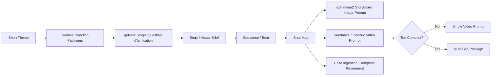

# storyboard-video-director

[中文](README.md) | [English](README_en.md)

## AI Storyboard and Video Shot Director Skill

`storyboard-video-director` is a standard Skill package for **AI video production, cinematic pre-production, storyboard design, gpt-image2 storyboard image prompts, and Seedance / generic video prompts**.

It is not a collection of fixed prompts. It is a reusable pre-production workflow that starts from a short theme and guides the user through creative direction, grill-me clarification, story expansion, shot design, storyboard image prompts, video prompts, case ingestion, and template refinement.

---

## 1. What problem does this Skill solve?

| Problem | Traditional Approach | This Skill |
|---|---|---|
| The user only has a rough theme | Write a prompt directly, often vague | Offer 3–5 creative direction packages first, then narrow down |
| Storyboard image and video prompt drift apart | They are written separately | Both derive from one shared Shot Map |
| AI video actions jump or feel unmotivated | Only describe visuals | Use action causality and continuity control |
| A long video is overloaded into one prompt | One giant prompt | Auto-detect whether Multi-Clip planning is needed |
| Good examples are hard to reuse | Save raw text snippets | Case ingestion → deconstruction → template families |

---

## 2. Workflow Overview



Core principle: **one Shot Map, multiple outputs**.

```text
Project Brief
→ Story / Visual Brief
→ Sequence / Beat Layer
→ Shot Map
→ Storyboard Image Prompt Extension
→ Video Prompt Extension
```

---

## 3. Core Capabilities

### 3.1 Adaptive Mode Routing

| User Intent | Skill Mode | Output |
|---|---|---|
| Design a storyboard | Storyboard Design | Creative summary, Beat, Shot Map |
| Generate storyboard image | Storyboard Image Prompt | Chinese / English gpt-image2 prompt |
| Generate video prompt | Video Prompt | Chinese / English video prompt |
| Build a complete video package | Complete Package | Plan + image prompt + video prompt |
| Save a strong example | Case Ingestion | Case card + template suggestion |
| Organize case library | Template Maintenance | Template classification and update plan |

### 3.2 gpt-image2 Storyboard Image Prompt

| Dimension | Default Strategy |
|---|---|
| Aspect ratio | 16:9 wide cinematic storyboard sheet |
| Panel count | Adaptive, usually 4–8, max 16 |
| Image text | Short Chinese labels by default; English optional |
| Layout | Reference Strip + Storyboard Grid + Technical Bar when useful |
| Consistency | Strong character / product / robot / prop consistency |
| Text density | Avoid long paragraphs and crowded layouts |

### 3.3 Video Prompt Generation

Video prompts are not locked into a rigid Seedance format. They use adaptive prompt dimensions:

| Module | Purpose |
|---|---|
| Format | Duration, shot count, rhythm density |
| Subjects | Characters, subjects, reference asset binding |
| Scene | Location, route, spatial logic |
| Action Logic | Cause-and-effect chain; visible triggers |
| Shot Sequence | Shot order, size, angle, movement |
| Audio Design | SFX, dialogue, voiceover, BGM when useful |
| Mood | Emotional arc |
| Color Logic | Palette and lighting logic |
| Style | Visual language, texture, medium |
| Constraints | Negative constraints, consistency, feasibility control |

### 3.4 Action Causality and Continuity

For mechanical, action, chase, combat, and product-demo videos, the default logic is:

```text
visible setup
→ tool / contact / operation
→ visible reaction
→ payoff
```

Continuity tracking includes:

| Continuity Target | What to Track |
|---|---|
| Character / subject | Position, direction, body state, emotional state |
| Props | Whether they remain in hand, change, or disappear |
| Scene | Spatial direction, geography, lighting continuity |
| Object state | Damage, deformation, opening, falling, loosened parts |
| Shot connection | How the previous shot ending connects to the next opening |

### 3.5 Adaptive Audio Design

Audio Design is a default inspection dimension, but dialogue, voiceover, and BGM are not forced.

| Video Type | Audio Strategy |
|---|---|
| Action / mechanical | Focus on SFX, impacts, metal sounds, footsteps |
| Emotional / ad / mood | BGM, ambience, silence, breathing room |
| Vlog / dialogue / drama | Natural dialogue or voiceover when useful |
| Product / training | Operation sounds, UI feedback, concise narration |
| Silent visual film | Specify `minimal sound / ambient only` |

### 3.6 Subtitle Policy

V1 does not automatically add subtitles, screen text, or caption stickers. These are included only when the user explicitly requests them.

---

## 4. Installation

> Installation paths vary by host. This repository is a standard Skill folder: any compatible host that can load a directory containing `SKILL.md` should be able to use it.

### Option A: Use as a Git repository, recommended for development

```bash
git clone git@github.com:twj515895394/storyboard-video-director.git
cd storyboard-video-director
python scripts/validate_skill.py .
```

Best for:

- maintaining this Skill;
- adding cases, templates, or scripts;
- using GitHub Actions validation.

### Option B: Copy into your Agent / Claude Code / compatible host Skills directory

```bash
cp -R storyboard-video-director <YOUR_SKILLS_DIR>/storyboard-video-director
```

Expected layout:

```text
<YOUR_SKILLS_DIR>/storyboard-video-director/SKILL.md
<YOUR_SKILLS_DIR>/storyboard-video-director/references/
<YOUR_SKILLS_DIR>/storyboard-video-director/assets/
<YOUR_SKILLS_DIR>/storyboard-video-director/scripts/
```

`<YOUR_SKILLS_DIR>` depends on your actual host. It may be called workspace skills, global skills, custom skills, or project skills.

### Option C: Package as a zip for import

```bash
python scripts/package_skill.py . --out storyboard-video-director.zip
```

If your host supports Skill archive import, import `storyboard-video-director.zip`.

### Option D: Use as a project-level Skill

```text
project-root/
└── skills/
    └── storyboard-video-director/
        ├── SKILL.md
        ├── references/
        ├── assets/
        └── scripts/
```

---

## 5. Verify Installation

```bash
python scripts/validate_skill.py .
```

Expected output:

```text
OK: storyboard-video-director skill package looks valid.
```

Compile a sample prompt:

```bash
python scripts/compile_prompt.py assets/examples/sample-shot-map.json --mode complete --lang both
```

Package the Skill:

```bash
python scripts/package_skill.py . --out storyboard-video-director.zip
```

---

## 6. Quick Usage Examples

### Example 1: Complete AI video pre-production package

```text
I want to make a 15-second AI short film: a small robot discovers it has been replaced inside an abandoned factory. Design the full pre-production package from theme to video prompt.
```

### Example 2: gpt-image2 storyboard image prompt only

```text
Turn this theme into a 16:9 cinematic storyboard image prompt for gpt-image2, with Chinese labels by default.
```

### Example 3: Video prompt only

```text
Generate a Seedance-style 15-second video prompt. Keep the action fast, no dialogue, focus on mechanical SFX and clear action causality.
```

### Example 4: Case ingestion

```text
Ingest this strong video prompt example, deconstruct its structure, and decide whether it should become a reusable template.
```

---

## 7. Repository Structure

```text
storyboard-video-director/
├── SKILL.md
├── README.md
├── README_en.md
├── .github/workflows/validate.yml
├── references/
│   ├── 00-router.md
│   ├── 01-grill-me-workflow.md
│   ├── 02-brief-shot-map-schema.md
│   ├── 03-storyboard-image-prompt-builder.md
│   ├── 04-video-prompt-builder.md
│   ├── 05-action-causality-continuity.md
│   ├── 06-audio-design-layer.md
│   ├── 07-multi-clip-controller.md
│   ├── 08-case-ingestion-template-library.md
│   └── 09-quality-checklist.md
├── assets/
│   ├── templates/
│   ├── prompt-snippets/
│   ├── examples/
│   └── case-cards/
├── schemas/
├── scripts/
└── docs/
```

---

## 8. Automation Scripts

| Script | Purpose |
|---|---|
| `scripts/validate_skill.py` | Validate Skill structure, frontmatter, core references, and schemas |
| `scripts/compile_prompt.py` | Compile draft image / video prompts from a Shot Map JSON |
| `scripts/scaffold_case.py` | Generate a case-card scaffold from a raw example |
| `scripts/package_skill.py` | Validate and package the Skill as a zip |

---

## 9. Case Library

The case library is optional. The Skill works with built-in SOP rules even when no custom case cards exist.

When you find a strong example, ask:

```text
Ingest this case, deconstruct its structure, and decide whether it should become a reusable template.
```

Or scaffold a case card with:

```bash
python scripts/scaffold_case.py \
  --raw assets/examples/seedance-sabotage-example.md \
  --name "sabotage action" \
  --family "action-mechanical" \
  --mode video
```

---

## 10. GitHub Actions

The repository includes CI:

```text
.github/workflows/validate.yml
```

On push / pull request it runs:

```bash
python scripts/validate_skill.py .
python scripts/compile_prompt.py assets/examples/sample-shot-map.json --mode complete --lang both
python scripts/package_skill.py . --out /tmp/storyboard-video-director.zip
```

---

## 11. Roadmap

- Add model preference references for Seedance, Kling, Veo, Runway, and Sora.
- Add more real-world case cards.
- Add a script for updating template families from case cards.
- Add stricter JSON Schema validation.
- Add more gpt-image2 storyboard style templates.
- Add more high-quality AI video prompt examples.
